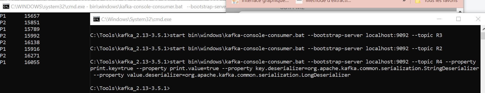

# Event Driven Architecture

Event-Driven Architecture (EDA) is an architectural paradigm used in software design and development. It's a way of building and structuring systems where events, which can be thought of as significant occurrences or changes in the system, drive the flow of data and trigger actions. EDA is particularly useful for building scalable, loosely coupled, and responsive systems that can handle a wide range of real-time scenarios. Here are some key concepts and components of Event-Driven Architecture:

<ol><li>Events: Events are messages or notifications that represent something of interest that has happened within a system. Events can be generated by various parts of the system, such as user actions, sensors, or other systems.

<li>Event Producers: Event producers are components or entities within the system that generate and emit events. These can be user interfaces, application components, or external systems.</li>

<li>Event Consumers: Event consumers are components or entities within the system that listen for and react to events. They can be responsible for performing actions, making decisions, or updating their internal state based on the events they receive.</li>

<li>Event Broker/Message Queue: An event-driven architecture often includes a central component known as an event broker or message queue. This component acts as an intermediary that receives events from producers and delivers them to consumers. Popular event broker solutions include Apache Kafka, RabbitMQ, and Amazon SNS/SQS.</li>

<li>Decoupling: EDA promotes loose coupling between components. Event producers and consumers are not directly aware of each other, which makes it easier to change or extend the system without affecting other parts.</li>

<li>Asynchronicity: EDA allows for asynchronous communication between components. Producers send events without waiting for consumers to process them immediately, which can improve system responsiveness and scalability.</li>

<li>Event Sourcing: Event sourcing is a technique often used in event-driven architectures, where the state of the system is derived from a sequence of events. This approach provides a full audit trail of changes and enables easy reconstruction of system state at any point in time.</li>

<li>CQRS (Command Query Responsibility Segregation): CQRS is another pattern that often goes hand-in-hand with EDA. It separates the read (query) and write (command) sides of a system, allowing for specialized optimizations on each side.</li>

<li>Scalability: EDA can help with building scalable systems because events can be processed independently and in parallel, which can be especially important in systems with high loads and large user bases.</li>

<li>Event-Driven Microservices: Many modern microservices architectures rely on EDA. Each microservice can act as an event producer and consumer, allowing for the development of loosely coupled, independently deployable services.</li></ol>

<b>work to do : </b>


## 1- Setting Up and Running Kafka for Event Messaging


<b>We perform testing using Kafka-console-producer and kafka-console-consumer :</b>


## 2-With Docker 
<b>1- We create the file docker-compose.yml : </b>
```
version: '3'
services:
  zookeeper:
    image: confluentinc/cp-zookeeper:7.3.0
    container_name: zookeeper
    environment:
      ZOOKEEPER_CLIENT_PORT: 2181
      ZOOKEEPER_TICK_TIME: 2000

  broker:
    image: confluentinc/cp-kafka:7.3.0
    container_name: broker
    ports:
      # To learn about configuring Kafka for access across networks see
      # https://www.confluent.io/blog/kafka-client-cannot-connect-to-broker-on-aws-on-docker-etc/
      - "9092:9092"
    depends_on:
      - zookeeper
    environment:
      KAFKA_BROKER_ID: 1
      KAFKA_ZOOKEEPER_CONNECT: 'zookeeper:2181'
      KAFKA_LISTENER_SECURITY_PROTOCOL_MAP: PLAINTEXT:PLAINTEXT,PLAINTEXT_INTERNAL:PLAINTEXT
      KAFKA_ADVERTISED_LISTENERS: PLAINTEXT://localhost:9092,PLAINTEXT_INTERNAL://broker:29092
      KAFKA_OFFSETS_TOPIC_REPLICATION_FACTOR: 1
      KAFKA_TRANSACTION_STATE_LOG_MIN_ISR: 1
      KAFKA_TRANSACTION_STATE_LOG_REPLICATION_FACTOR: 1
```
<b>2- We start the Docker containers for Zookeeper and Kafka broker.</b>


<b> 3- We perform testing using Kafka-console-producer and kafka-console-consumer :</b>


## 3- KAFKA and Spring Cloud Streams
Using KAFKA and Spring Cloud Streams, we create:

<ul><li>A Kafka Service Producer via a REST Controller</li>
<li>A Kafka Service Consumer</li>
<li>A Kafka Service Supplier</li>
<li>A Real-Time Data Analytics Stream Processing Service with Kafka Streams</li>
<li>A web application that displays real-time results of the Data Analytics Stream."</li></ul>

### 3-1 - PageEvent : 
```
import lombok.AllArgsConstructor;
import lombok.Data;
import lombok.NoArgsConstructor;
import lombok.ToString;

import java.util.Date;
@Data @NoArgsConstructor @AllArgsConstructor @ToString
public class PageEvent {
    private String name;
    private String user;
    private Date date;
    private long duration;
}
```

### 3-2- REST Controller :
This code defines a PageEventRestController class that serves as a REST controller for interacting with Kafka streams. Here's a breakdown of the key functionalities within this code:

<ol><li>streamBridge and interactiveQueryService are autowired, which means Spring Boot will inject instances of these classes into your controller. StreamBridge is used for sending messages to Kafka topics, and InteractiveQueryService is used for querying Kafka Streams state stores.</li>

<li>The publish method is mapped to the endpoint /publish/{topic}/{name} using @GetMapping. It generates a PageEvent object, sends it to the specified Kafka topic using streamBridge.send(), and then returns the created PageEvent.</li>

<li>The analytics method is mapped to the /analytics endpoint, and it produces a text event stream using MediaType.TEXT_EVENT_STREAM_VALUE. It uses a Flux to periodically query the Kafka Streams state store for the latest analytics data. The retrieved data is transformed into a Map and emitted as a stream of events.</li></ol>

```
import org.apache.kafka.streams.KeyValue;
import org.apache.kafka.streams.kstream.Windowed;
import org.apache.kafka.streams.state.KeyValueIterator;
import org.apache.kafka.streams.state.QueryableStoreTypes;
import org.apache.kafka.streams.state.ReadOnlyWindowStore;
import org.sdia.demo.entities.PageEvent;
import org.springframework.beans.factory.annotation.Autowired;
import org.springframework.cloud.stream.binder.kafka.streams.InteractiveQueryService;
import org.springframework.cloud.stream.function.StreamBridge;
import org.springframework.http.MediaType;
import org.springframework.web.bind.annotation.GetMapping;
import org.springframework.web.bind.annotation.PathVariable;
import org.springframework.web.bind.annotation.RestController;
import reactor.core.publisher.Flux;

import java.time.Duration;
import java.time.Instant;
import java.util.Date;
import java.util.HashMap;
import java.util.Map;
import java.util.Random;

@RestController
public class PageEventRestController {
    @Autowired
    private StreamBridge streamBridge;
    @Autowired
    private InteractiveQueryService interactiveQueryService;
    @GetMapping("/publish/{topic}/{name}")
    public PageEvent publish(@PathVariable String topic, @PathVariable String name){
        PageEvent pageEvent=new PageEvent(name,Math.random()>0.5?"U1":"U2",new Date(),new Random().nextInt(9000));
        streamBridge.send(topic,pageEvent);

        return pageEvent;

    }

    @GetMapping(path = "/analytics", produces= MediaType.TEXT_EVENT_STREAM_VALUE)
    public Flux<Map<String, Long>> analytics(){
        return Flux.interval(Duration.ofSeconds(1))
                .map(sequence->{
                    Map<String,Long>stringLongMap=new HashMap<>();
                    ReadOnlyWindowStore<String, Long> windowStore=interactiveQueryService.getQueryableStore("page-count", QueryableStoreTypes.windowStore());
                    Instant now= Instant.now();
                    Instant from=now.minusMillis(5000);
                    KeyValueIterator<Windowed<String>, Long> fetchAll=  windowStore.fetchAll(from,now);
                    while(fetchAll.hasNext()){
                        KeyValue<Windowed<String>, Long> next = fetchAll.next();
                        stringLongMap.put(next.key.key(),next.value);
                    }
                    return stringLongMap;

                }).share();
    }
}

```

### 3-3- PageEventService
This class appears to be responsible for creating several beans that define various functions related to processing and manipulating PageEvent objects in a Kafka stream processing application. Let's break down the key components:

<ul><li><b>pageEventConsumer:</b> This bean defines a Kafka consumer for PageEvent objects. When a PageEvent is received, it prints the event to the console. This function represents a basic consumer of events.</li>

<li><b>pageEventSupplier:</b> This bean defines a Kafka supplier for generating random PageEvent objects. It creates PageEvent instances with random attributes like name, user, date, and duration.</li>

<li><b>pageEventFunction:</b> This bean defines a Kafka function that takes a PageEvent as input and modifies its name and user attributes. In this case, it changes the name's length and sets the user to "UUUUUU."</li>

<li><b>KStreamFunction:</b> This bean defines a Kafka stream processing function . It filters events based on the duration, groups them by the event's name, and calculates a count within 5-second windows. The result is written to a state store named "page-count," and a transformed stream is returned.</li></ul>

```
import org.apache.kafka.common.serialization.Serdes;
import org.apache.kafka.streams.KeyValue;
import org.apache.kafka.streams.kstream.Grouped;
import org.apache.kafka.streams.kstream.KStream;
import org.apache.kafka.streams.kstream.Materialized;
import org.apache.kafka.streams.kstream.TimeWindows;
import org.sdia.demo.entities.PageEvent;
import org.springframework.context.annotation.Bean;
import org.springframework.stereotype.Service;

import java.time.Duration;
import java.util.Date;
import java.util.Random;
import java.util.function.Consumer;
import java.util.function.Function;
import java.util.function.Supplier;

@Service
public class PageEventService {
    @Bean
    public Consumer<PageEvent> pageEventConsumer(){
        return(input)->{
            System.out.println("****************************");
            System.out.println(input.toString());
            System.out.println("****************************");
        };
    }
    @Bean
    public Supplier<PageEvent> pageEventSupplier(){
        return ()-> new PageEvent(
                Math.random()>0.5?"P1":"P2",
                Math.random()>0.5?"U1":"U2",
                new Date(),
                new Random().nextInt(9000));
    }
    @Bean
    public Function<PageEvent,PageEvent> pageEventFunction(){
        return(input)->{
            input.setName("L:"+input.getName().length());
            input.setUser("UUUUUU");
            return input;
        };
    }
    @Bean
    public Function<KStream<String,PageEvent>, KStream<String,Long>>KStreamFunction(){
        return (input)->{
            return input
                    .filter((k,v)->v.getDuration()>100)
                    .map((k,v)->new KeyValue<>(v.getName(),0L))
                    .groupBy((k,v)->k,Grouped.with(Serdes.String(),Serdes.Long()))
                    .windowedBy(TimeWindows.of(Duration.ofSeconds(5)))
                    .count(Materialized.as("page-count"))
                    .toStream()
                    .map((k,v)->new KeyValue<>("=>"+k.window().startTime()+k.window().endTime()+k.key(),v));

        };
    }
}

```

### 3-4- Web application :
The HTML code is a web page for displaying real-time analytics using the SmoothieChart library and an EventSource to receive data from a server.

```
<!DOCTYPE html>
<html lang="en">
<head>
    <meta charset="UTF-8">
    <title>Analytics</title>
    <script src="https://cdnjs.cloudflare.com/ajax/libs/smoothie/1.34.0/smoothie.min.js"></script>
</head>
<body>
<canvas id="chart2" width="600" height="400"></canvas>
<script>    var index = -1;
randomColor = function () {
    ++index;
    if (index >= colors.length) index = 0;
    return colors[index];
}
var pages = ["P1", "P2"];
var colors = [
    {sroke: 'rgba(0, 255, 0, 1)', fill: 'rgba(0, 255, 0, 0.2)'},
    {sroke: 'rgba(255, 0, 0, 1)', fill: 'rgba(255, 0, 0, 0.2)'
    }];
var courbe = [];
var smoothieChart = new SmoothieChart({tooltip: true});
smoothieChart.streamTo(document.getElementById("chart2"), 500);
pages.forEach(function (v) {
    courbe[v] = new TimeSeries();
    col = randomColor();
    smoothieChart.addTimeSeries(courbe[v], {strokeStyle: col.sroke, fillStyle: col.fill, lineWidth: 2});
});
var stockEventSource = new EventSource("/analytics");
stockEventSource.addEventListener("message", function (event) {
    pages.forEach(function (v) {
        val = JSON.parse(event.data)[v];
        courbe[v].append(new Date().getTime(), val);
    });
});</script>
</body>
</html></body></html>
```

### application.properties:
These properties define various bindings, destinations, and settings for different components within Spring Cloud Stream application.

```
spring.cloud.stream.bindings.pageEventConsumer-in-0.destination=R1
spring.cloud.stream.bindings.pageEventSupplier-out-0.destination=R2
spring.cloud.stream.poller.fixed-delay=100
spring.cloud.stream.bindings.pageEventFunction-in-0.destination=R2
spring.cloud.stream.bindings.pageEventFunction-out-0.destination=R3
spring.cloud.function.definition=pageEventConsumer;pageEventSupplier;pageEventFunction;KStreamFunction
spring.cloud.stream.bindings.KStreamFunction-in-0.destination=R2
spring.cloud.stream.bindings.KStreamFunction-out-0.destination=R4
spring.cloud.stream.kafka.streams.binder.configuration.commit.interval.ms=1000
```

### application.yml
This configuration file defines the messaging destinations, groups, and Kafka Streams application ID for the Spring Cloud Stream application. It also specifies the behavior of Kafka consumers within the application. 

```
server:
  port: 8090
spring.cloud.stream:
  function:
    definition : pageEventConsumer;pageEventSupplier;pageStreamConsumer;kStreamFunction2
  bindings:
    pageEventConsumer-in-0:
      destination: R224
      group: G1
    pageEventSupplier-out-0:
      destination: R333
    kStreamFunction2-in-0:
      destination: R333
      group: G44
    kStreamFunction2-out-0:
      destination: R66
spring:
  kafka:
    streams:
      application-id: app2
    consumer:
      enable-auto-commit: true
      auto-offset-reset: earliest

```

### Execution : 





